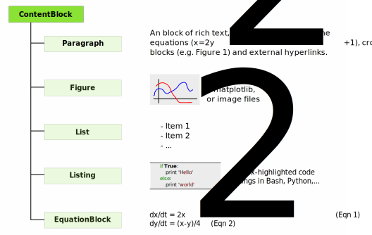

.. contents::

Overview
==========

MRedoc ( **M** odular **Re** duced **Doc** umentation Model) is a minimal API for generating HTML and LaTeX documents containing text, equations, figures and tables from Python.

.. note::
	
	It is more aimed as an API for libraries, if you are looking to build pdf/html documentation for a specific case you might be better off with sphinx.

It is designed as a simple interface for generating summaries of simulations of models in computational neuroscience; often models contain many parameters and are controlled by a variety of non-trivial equations. MReDoc contains a simple set of primitives for documenting mathematical models.

Although other libraries, (e.g.  Reportlab, Sphinx), have more comprehensive APIs for, for example, font customisation, page layout, MRedoc is more focused on a simple set of objects that can be simply embedded within each other and easily produce high quality output. It was designed to allow decoupled components to each generate out different parts of a report.

It allows easy embedding of matplotlib graphs, LaTeX style equations, syntax highlighted code snippets and more into (LaTeX) pdfs and HTML documents.

Example
=======

For example, the following code creates HTML and Latex representations of some
basic trigonometry.
:download:`this example script <./generated_src/example1/pdf/output.pdf>`
`Link text <http://example.com/>`_

.. literalinclude:: generated_src/example1.py

Creates the following pdf and the following HTML output.

Installation
============

Requirements
~~~~~~~~~~~~ 
  * matplotlib 
  * LaTeX 
  * ImageMagick convert
  * (Network connection for mathjax)

License
~~~~~~~
**mredoc** is released under the BSD 2 license. 

Installation
~~~~~~~~~~~~~

**mredoc** is available on github: 

`https://github.com/mikehulluk/mredoc`

Acknowledgments
~~~~~~~~~~~~~~~

 * xml-witch
 * ajaxmath

API
====

Sections & ContentBlocks 
~~~~~~~~~~~~~~~~~~~~~~~~

A Document is a tree of made of Sections and ContentBlocks.
 * Blocks contain content; There are X types of blocks; Figure, Table, Listing, Equation, List and Paragraph.
 * Sections contain *sub* Sections and blocks and represent the hierachical structure of the document.

A Document is a tree of elements. It is possible to create different parts of a document in different parts of the program, and combine them at the end into a single document. Once the tree has been built, it can be converted to PDF or HTML using HTMLWriter or LatexWriter.

.. figure:: img_srcs/document_section_blocks.svg

	A **Document** is a hierachy of **Sections** and **Blocks**. The
	Document points to a single Section. Sections can contain Blocks 
	and *chidren* Sections. ContentBlocks contain content, for example 		Figures, Equations and Text.

	The *ContentBlock* types

RichText
~~~~~~~~

Often we want to use *RichText*, in which we have equations text and hyperlinks
all inline in a sentence, rather than individual blocks. This requires that our
paragraphs can contain more than just text and is handled in mredoc using the
RichTextContainer. RichTextContainer objects can contain:

  * Text
  * Inline equations
  * Internal Reference (e.g. 'see Figure 2')
  * Exteral Links

.. figure:: img_srcs/richtext_structur.svg

	

Object API 
~~~~~~~~~~

Basic Object Construction
^^^^^^^^^^^^^^^^^^^^^^^^^^^^

MReDoc's API is designed to be simple to use as possible. It is quite relaxed
about the parameters which can be parsed to various constructors, and will try
to do TheRightThing. Although the internal object representation is quite strict,
passing a string or a matplotlib image directly to the constructors in the 
object model will automatically
The following are the most commonly used objects:

.. autofunction:: mredoc.Section
.. autofunction:: mredoc.Paragraph
.. autofunction:: mredoc.Figure
.. autofunction:: mredoc.Table
.. autofunction:: mredoc.List
.. autofunction:: mredoc.CodeListing
.. autofunction:: mredoc.EquationBlock
.. autofunction:: mredoc.Document

mredoc is designed for libraries rather than end-users, so its API is designed
in terms of objects rather than strings (in constrast with Sphinx for example).
However, it does allow Sphinx-like markup; it will automatically break long text
strings into RichTextObjects references

For examples::

Strings & Matplotlib figures:

Creating Output
^^^^^^^^^^^^^^^^

HTML and Latex output can be created by calling ``to_pdf`` or ``to_html`` on any 
mredoc object.

.. autofunction:: mredoc.objects.core._DocumentObject.to_pdf
.. autofunction:: mredoc.objects.core._DocumentObject.to_html

Occastionally 
^^^^^^^^^^^^^^
Sometimes useful are:

.. autofunction:: mredoc.Heading

Todo
====

See Also
=========

More Examples:
===============

.. literalinclude:: ../src/testing/sample2.py 
